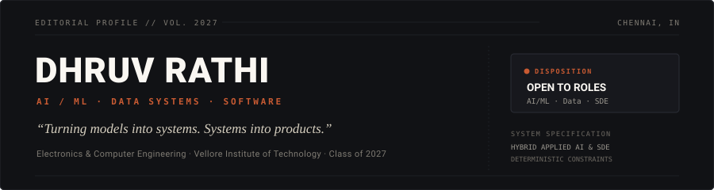
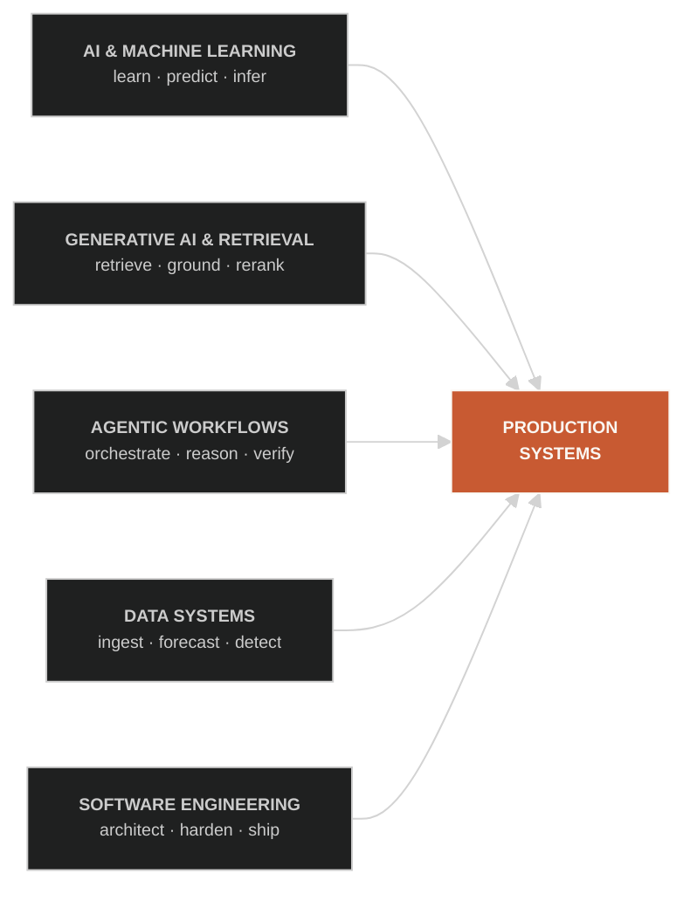

  

 

```mermaid
%%{init: {'theme': 'dark', 'themeVariables': {'fontSize': '10px', 'nodeSpacing': 10, 'rankSpacing': 30}}}%%
flowchart LR
    A["<b>AI & MACHINE LEARNING</b><br/>learn · predict · infer"] --> S["<b>PRODUCTION<br/>SYSTEMS</b>"]
    B["<b>GENERATIVE AI & RETRIEVAL</b><br/>retrieve · ground · rerank"] --> S
    C["<b>AGENTIC WORKFLOWS</b><br/>orchestrate · reason · verify"] --> S
    D["<b>DATA SYSTEMS</b><br/>ingest · forecast · detect"] --> S
    E["<b>SOFTWARE ENGINEERING</b><br/>architect · harden · ship"] --> S

    style S fill:#c85a32,stroke:#FAF7F2,stroke-width:1px,color:#FAF7F2
```

 

---

### TECH STACK

---

 

### SOCIALS

