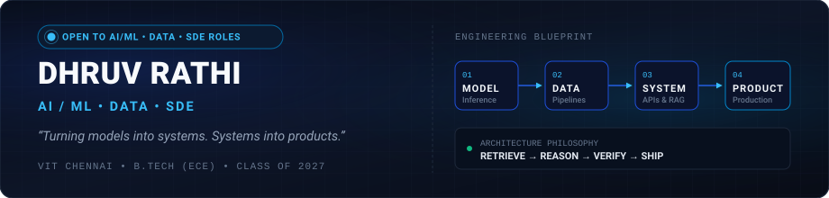
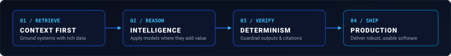

# Dhruv Rathi

  

  <a href="https://dhruvrathi.pages.dev"><strong>Portfolio</strong></a> &nbsp;•&nbsp;
  <a href="https://www.linkedin.com/in/dhruv-rathi-31dr"><strong>LinkedIn</strong></a> &nbsp;•&nbsp;
  <a href="https://github.com/dhruv-rathi-tech"><strong>GitHub</strong></a> &nbsp;•&nbsp;
  <a href="https://dhruvrathi.pages.dev"><strong>Resume</strong></a> &nbsp;•&nbsp;
  <a href="mailto:rathidhruv3112@gmail.com"><strong>Email</strong></a>

  <code>🟢 OPEN TO AI/ML • DATA • SDE ROLES</code>

---

## About Me

I am a final-year B.Tech student in Electronics and Computer Engineering at VIT Chennai, building AI-powered applications, data pipelines, and production-oriented software systems. My work spans predictive modeling, retrieval-augmented generation (RAG), agentic workflows, and full-stack backend architectures. I focus on bridging the gap between raw models and real-world utility—designing grounded, deterministic systems that turn experiments into reliable, high-performance software.

---

## What I'm Into

| Domain | Focus Areas & Capabilities |
| :--- | :--- |
| **AI / ML** | Predictive modeling • Deep learning • Computer vision • NLP • Applied machine learning |
| **Generative AI** | RAG • LLM applications • Embeddings • Dense/sparse retrieval • Cross-encoder reranking • Prompt engineering |
| **Agentic Systems** | Tool calling • Multi-agent workflows • AI automation • Structured reasoning • Verification workflows |
| **Data** | Advanced SQL • Telemetry & EDA • Time-series forecasting • Anomaly detection • Feature engineering |
| **Software Engineering** | Full-stack applications • REST APIs • Relational schemas • Authentication & RBAC • Async workflows • Production systems |
| **Intelligent Systems** | ML-software integration • AI-assisted decision systems • Concurrency control • Research-oriented ML architectures |

---

## How I Like to Build

   Reason -> Verify -> Ship Engineering Pipeline" width="100%" />

 

`[ 01 · RETRIEVE ]` &nbsp; **Context First**  
Give systems the right information before asking them to act. Whether through dense vector embeddings, BM25 keyword search, or structured database telemetry, high-leverage software begins with grounded, domain-specific retrieval.

`[ 02 · REASON ]` &nbsp; **Targeted Intelligence**  
Use models and machine intelligence where they provide meaningful value. From attention-based classification and forecasting to LLM orchestration, intelligence should solve core operational friction rather than serve as superficial novelty.

`[ 03 · VERIFY ]` &nbsp; **Grounded & Deterministic**  
Keep important outputs grounded, reproducible, and deterministic where appropriate. Enforce schema validations, citation checks, guardrails, and concurrency controls so the system behaves predictably under production constraints.

`[ 04 · SHIP ]` &nbsp; **Production Software**  
Turn experiments into usable, accessible software instead of stopping at a notebook. Wrap intelligence in resilient backend APIs, intuitive interfaces, and robust deployment pipelines that deliver tangible user value.

---

## Tech Stack

| Category | Technologies & Tooling |
| :--- | :--- |
| **Languages** | `Python` `Java` `C / C++` `JavaScript` `TypeScript` `SQL` |
| **AI / Machine Learning** | `PyTorch` `TensorFlow` `Keras` `Scikit-learn` `OpenCV` |
| **GenAI / NLP** | `RAG` `LLM Integration` `LangChain` `SentenceTransformers` `Groq` `Hugging Face` |
| **Retrieval & Search** | `ChromaDB` `BM25 Sparse Search` `Dense Embeddings` `Cross-Encoder Reranking` |
| **Backend & APIs** | `FastAPI` `Node.js` `Express.js` `REST APIs` `Async Endpoints` `JWT & OAuth` |
| **Frontend** | `React` `Next.js` `Tailwind CSS` `Streamlit` |
| **Databases & Storage** | `PostgreSQL` `MySQL` `SQLite` `Redis` |
| **Tools & Infrastructure** | `Git` `GitHub` `Docker` `Linux` `Postman` `Pydantic` |

---

## Connect / Explore

- **Portfolio**: [dhruvrathi.pages.dev](https://dhruvrathi.pages.dev)
- **LinkedIn**: [linkedin.com/in/dhruv-rathi-31dr](https://www.linkedin.com/in/dhruv-rathi-31dr)
- **GitHub**: [github.com/dhruv-rathi-tech](https://github.com/dhruv-rathi-tech)
- **Resume**: [View Resumes on Portfolio](https://dhruvrathi.pages.dev)
- **Email**: [rathidhruv3112@gmail.com](mailto:rathidhruv3112@gmail.com)

---

  AI • Data • Software Engineering &nbsp;|&nbsp; Turning models into systems. Systems into products.

