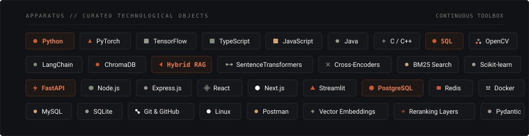

  

 

### ABOUT

Final-year Electronics & Computer Engineering student at VIT Chennai.

I build across machine learning, generative AI, data systems, and software engineering. Most of my work focuses on the translation layer — bridging probabilistic model inference with deterministic, resilient production software.

 

---

### WHAT I BUILD

**AI & MACHINE LEARNING**  
Predictive modeling · Deep learning architectures · Computer vision · Applied ML inference

**GENERATIVE AI & RETRIEVAL**  
Hybrid RAG · Dense & sparse vector search · Cross-encoder reranking · High-dimensional embeddings

**AGENTIC SYSTEMS**  
Tool orchestration · Multi-step reasoning · Self-correcting workflows · Invariant validation

**DATA PLATFORMS**  
Advanced SQL schemas · Telemetry & ETL pipelines · Time-series forecasting · Anomaly detection

**SOFTWARE ENGINEERING**  
FastAPI & Node microservices · Relational architectures · Strict contract validation · Concurrency

 

---

### APPARATUS

  

 

---

 

[ **PORTFOLIO** ](https://dhruvrathi.pages.dev) &emsp;·&emsp; [ **LINKEDIN** ](https://www.linkedin.com/in/dhruv-rathi-31dr) &emsp;·&emsp; [ **GITHUB** ](https://github.com/dhruv-rathi-tech) &emsp;·&emsp; [ **RESUME** ](https://dhruvrathi.pages.dev) &emsp;·&emsp; [ **EMAIL** ](mailto:rathidhruv3112@gmail.com)

 

DHRUV RATHI &nbsp;·&nbsp; VIT CHENNAI &nbsp;·&nbsp; CLASS OF 2027

